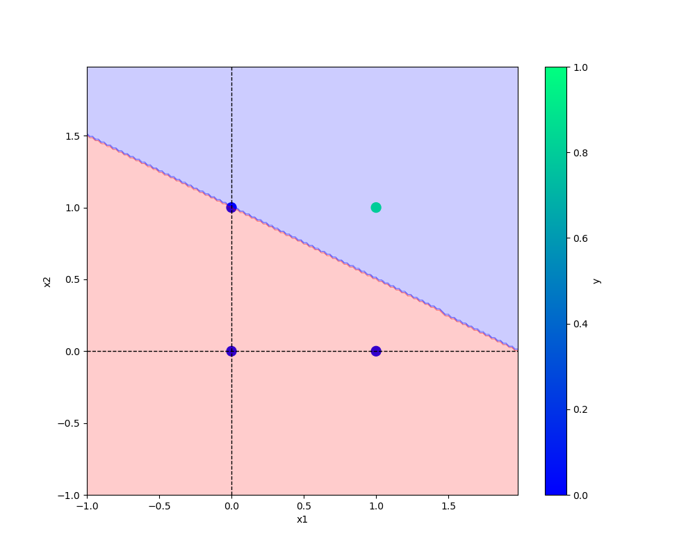

# Percetron
I neroun
```python
def main(data,eta,epochs,modelfilename,plotpng):
    
    df = pd.DataFrame(data)
    logging.info(f"This is me{df}")

    x,y = prepare_data(df)

    

    model = Perceptron(eta=eta,epochs=epochs)
    model.fit(x,y)

    model.total_loss()

    save_Model(model,filename=modelfilename)
    save_plot(df,plotpng,model)
```
